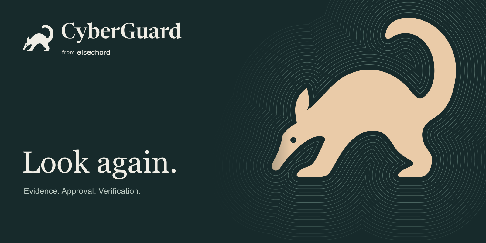
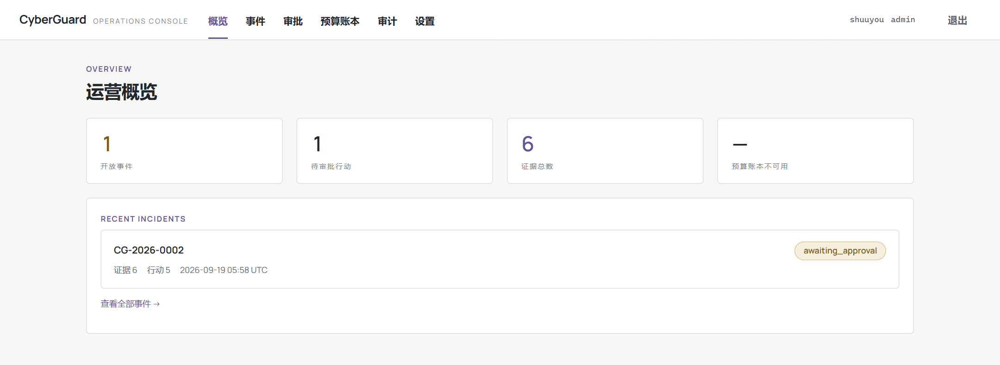
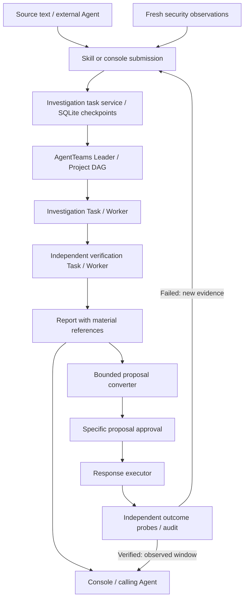

<p align="center">
  
</p>

<p align="center"><strong>English</strong> · <a href="README.zh-CN.md">简体中文</a></p>
<p align="center">
  <a href="https://github.com/elsechord/CyberGuard/actions/workflows/ci.yml"></a>
  <a href="LICENSE"></a>
  <a href="https://github.com/elsechord/CyberGuard/releases"></a>
</p>

**Investigations grounded in evidence. Responses checked against outcomes.**

CyberGuard provides investigation and response-governance infrastructure for Agents. Your existing Agent submits materials through a Skill; AgentTeams plans native tasks, investigates and independently reviews the findings, then returns a report with source quotations. Security teams can also use proposal-bound approvals, execution and outcome probes to distinguish a successful command from a resolved incident.

[New walkthrough video](https://github.com/elsechord/CyberGuard/releases/download/v0.15.0/cyberguard-finals-20260920.mp4) · [Finals walkthrough](docs/FINALS_ENTRY.md) · [Capabilities and evidence](docs/PROVEN_CAPABILITIES.md) · [Deploy and connect](#deploy-the-console) · [Documentation](#documentation)

**Latest runs:** the same synthetic cryptomining case completed twice on the same configuration: Skill → native AgentTeams tasks → investigation → independent review → report delivery, in **5m 7s / 3m 52s**. Both reports identified that stopping the process did not establish clearance, and limited the later successful checks to the observed window. [Original reports, workflow records and review →](docs/FULL_CASE_VALIDATION.md)

## What you can do

| Your task | CyberGuard provides | Start here |
| --- | --- | --- |
| Delegate an investigation from your existing Agent | Connection instructions, material submission and backend reports | [Connect your Agent](docs/EXTERNAL_AGENT_SKILL.md#从控制台连接推荐) |
| Review a proposed response | A console for targets, reasons, approval decisions and incident history | [Operations console](docs/OPERATIONS_CONSOLE.md) |
| Check whether a response worked | Run-linked observations, execution records and verification results | [Real process laboratory](docs/HOST_LAB.md) |
| Bring existing security telemetry | Suricata file ingest and configurable read-only HTTP connectors | [Ingest](docs/INGEST.md) · [Connectors](docs/LIVE_CONNECTORS.md) |

## Deploy the console

**Start with the web setup wizard.** On Linux / WSL2 with Git, Python 3.12+ and Docker Compose, run from the repository checkout:

```bash
sudo python3 deploy/onboarding/bootstrap.py
```

Open `http://127.0.0.1:18120/setup`. Create an administrator, enter your model endpoint, model name and API key, test the connection, initialize AgentTeams and enable investigations. Existing administrators can open **Settings → Deployment wizard**. Credentials remain on the deployment host. [Setup guide (Chinese)](docs/WEB_ONBOARDING.zh-CN.md) · [Chinese documentation](docs/README.zh-CN.md)

For manually managed deployments, follow the [native backend installation guide](docs/NATIVE_INSTALL.md). The following commands start the base console separately.

For analysts and teams who need an incident queue, approval screens, roles, API keys and an audit history.



With Git, Python 3.12+ and Docker Compose, run the following in Linux / WSL2 Bash:

```bash
git clone https://github.com/elsechord/CyberGuard.git
cd CyberGuard
python deploy/init_secrets.py
docker network inspect agentteams-net >/dev/null 2>&1 || docker network create agentteams-net
CYBERGUARD_COOKIE_SECURE=false docker compose up -d --build
```

This command uses local HTTP sessions. For public deployment, keep secure cookies enabled and configure HTTPS as described in the [deployment guide](docs/OPERATIONS_DEPLOY.md).

| Local entry | Purpose | Next step |
| --- | --- | --- |
| `http://127.0.0.1:18120` | Multi-user operations console | [Create the first administrator and configure HTTPS/sessions](docs/OPERATIONS_DEPLOY.md) |
| `http://127.0.0.1:18100/console` | Read-only evidence audit view | [Collect the first fixture evidence](docs/QUICKSTART.md) |

The base deployment includes the console and a simulation response backend. Configure the administrator and HTTPS sessions, then follow the [fresh-install guide](docs/NATIVE_INSTALL.md) to connect AgentTeams and your model for live investigations.

**Then connect your Agent:** open `/connect`, generate Skill v0.2.0 instructions and an investigation API key, and save the key in a private file on the Agent host. The Agent installs the Skill and checks its connection; you can then ask it to submit materials, follow tasks and retrieve reports. [Connection guide →](docs/EXTERNAL_AGENT_SKILL.md)

You can also submit text or multi-source JSON directly in `/investigations`. Logs, financial records, audit reports and judicial documents share one material envelope, supporting plain text, JSON, CSV and Markdown. Source text and submitter interpretation stay separate. [Material formats and domain adaptation →](docs/INVESTIGATION_TASKS.md)

The SQLite queue and stage checkpoints keep the investigation moving after the calling Agent disconnects. The Console shows waiting, running, failure and delivery states. [Runtime configuration and task controls →](docs/AGENTTEAMS_TASK_SERVICE.md)

## Use with your Agent

Keep your current Agent as the interaction entry point. The Skill's main role is backend delegation: submit authorized materials, inspect task status and retrieve the report. It requires file access and Python 3.10+, while the deployment supplies the AgentTeams runtime and model configuration.

**Copy this into your coding Agent:**

```text
Set up CyberGuard Skill v0.2.0 in my current project and verify the configured
console connection. Obtain the source from https://github.com/elsechord/CyberGuard
in a separate directory, record the checked-out commit, and read
 docs/EXTERNAL_AGENT_SKILL.md and integrations/agent-skills/cyberguard/SKILL.md.
Inspect scripts/install-agent-skill.py before using it. Choose --agent codex,
--agent claude or --agent generic for this host and --project for this project.
Reuse a compatible installation; do not overwrite existing files.
Use the console origin and private key-file path supplied by /connect.
Run check --investigations and report the actual result. If configuration is
missing, explain what is needed. This setup request does not authorize uploading
materials, starting an investigation, deploying services or taking response actions.
```

Or install from a checkout:

```bash
python scripts/install-agent-skill.py --agent codex --project /absolute/path/to/project
# For Claude Code, use --agent claude. The project must already exist.
```

**No console yet?** Try the [synthetic offline exercise](docs/EXTERNAL_AGENT_SKILL.md#离线试用复制这段提示词), then connect the online backend for native tasks. Existing incident packages remain available through `check` / `fetch`.

## Execution succeeded. Recovery did not.

**One live case now runs end to end:** fresh process evidence enters native AgentTeams investigation; the report is converted into a bounded proposal. After approval and execution, independent probes detect recurrence. The new evidence triggers another native investigation, proposal, approval and verification. One **11m 18s** run passed **20 checks**, with separate investigation and review Workers in each round. [Original records and how to run it →](docs/LIVE_RESPONSE_DEMO.md)

The Linux process lab demonstrates why an execution receipt is not an outcome check:

| Step | What happens |
| --- | --- |
| Observe | Collect a harmless experiment process and its persistence configuration. |
| Propose and approve | Bind approval to a specific process target. |
| Execute | The executor terminates that process successfully. |
| Verify | The supervisor restarts it. Independent observations return **failed**. |
| Propose again | A new proposal targets the persistence configuration and receives a new approval. |
| Verify again | The experiment process and persistence are absent during the observation window; the control workload continues. Result: **verified**. |

The demonstration operates harmless processes and real files in an isolated Linux environment. Published validation uses test approval; operators can choose interactive approval for a live demonstration. [Run the dynamic proposal demo →](docs/LIVE_RESPONSE_DEMO.md)

<details>
<summary>Earlier exercises and component checks</summary>

- [Fixed-flow process lab](docs/HOST_LAB.md): scripted decisions for approval and outcome-check regression.
- [Account lab](docs/LAB_EXECUTION.md): disable access, probe independently and restore.
- [Earlier native task record](docs/LIVE_TASK_EVIDENCE.md): supply-chain collaboration and target correction.
- [v0.14.1 service walkthrough and evidence](https://github.com/elsechord/CyberGuard/releases/tag/v0.14.1).

</details>

## Connect your existing systems

Start with the interface that matches your workflow:

| Integration | Input → output | Available today |
| --- | --- | --- |
| Existing Agent / internal application | Authorized materials + objective → durable task → backend report | [Skill v0.2.0](docs/EXTERNAL_AGENT_SKILL.md) · [Task API](docs/INVESTIGATION_TASKS.md) |
| Existing incident package | Incident JSON / read-only API → evidence for local review | Legacy `check` / `fetch` |
| IDS export | Suricata EVE JSON/JSONL → normalized evidence | [File ingest adapter](docs/INGEST.md) |
| SIEM / EDR / NDR / CMDB | Configured upstream HTTP response → incident evidence | [Server-owned connector configuration](docs/LIVE_CONNECTORS.md); vendor mappings need adaptation |
| Internal application | Scoped API request → incident, evidence and proposal data | [Console API v1](docs/OPERATIONS_CONSOLE.md#api-v1) |
| SOAR / device execution | Approved proposal → response action → outcome observation | Executor extension work; production vendor-specific mutating integrations are not included |

For example, read incidents from a deployed console using a key with `incidents:read` scope:

```bash
# Bash. Configure these environment variables locally; do not put keys in source.
curl --fail --silent --show-error \
  -H "Authorization: Bearer ${CYBERGUARD_CONSOLE_API_KEY}" \
  "${CYBERGUARD_CONSOLE_URL}/api/v1/incidents?limit=5"
```

List responses use `data`, `has_more` and `next_cursor`. Read one incident at `/api/v1/incidents/{incident_id}`. API key scopes control endpoint permissions. [Endpoints, authentication and errors →](docs/OPERATIONS_CONSOLE.md#api-v1)

## How the components fit



AgentTeams handles native investigation and independent review. A bounded converter maps the report and fresh targets to allowed executor proposals. Approval precedes execution; new outcome observations determine whether investigation should continue. The recorded case uses harmless processes in an isolated Linux environment and test approvals, with interactive operator approval available. [Complete workflow →](docs/LIVE_RESPONSE_DEMO.md)

## Reuse and extend

- **Adaptive collaboration:** Workers can create temporary specialists, exchange directed questions and clean them up through native WorkerFlow. [Research](docs/ADAPTIVE_AGENT_RESEARCH.md) · [Validation](docs/ADAPTIVE_COLLABORATION_VALIDATION.md)

- **Evidence:** normalization, source metadata, identifiers and citation checks. [Observation model](docs/OBSERVATION_MODEL.md) · [Contracts](contracts/)
- **Controlled actions:** allowlisted dispatch, proposal-bound approvals, idempotency and action audit records. [Executor](services/response-executor/) · [Threat model](docs/THREAT_MODEL.md)
- **Outcome checks:** account-access and process-state probes, run correlation and evidence export. [Run example](docs/examples/run-correlation-CG-2026-0002.md)
- **Agent integration:** [ten AgentTeams role Skills](docs/SKILL_CATALOG.md), the [portable Skill](integrations/agent-skills/cyberguard/), and [local AgentTeams setup](docs/AGENTTEAMS_LOCAL.md).
- **Optional model admission guard:** per-run budget reservations and role-bound routes. [Guard documentation](docs/MODEL_GUARD.md)

Security is the first application domain. Financial, legal and other text can reuse the intake and review pipeline, with specialized interpretation, policies and outcome checks supplied through domain adaptation.

## Documentation

| Goal | Guide |
| --- | --- |
| Install or troubleshoot | [Quickstart](docs/QUICKSTART.md) · [Console deployment](docs/OPERATIONS_DEPLOY.md) |
| Delegate from your Agent | [Skill setup and connection](docs/EXTERNAL_AGENT_SKILL.md) · [Tasks and materials](docs/INVESTIGATION_TASKS.md) · [Backend configuration](docs/AGENTTEAMS_TASK_SERVICE.md) |
| Run a multi-Agent task | [AgentTeams bootstrap](agentteams/BOOTSTRAP.md) · [Local setup](docs/AGENTTEAMS_LOCAL.md) |
| Inspect the trust boundaries | [Threat model](docs/THREAT_MODEL.md) · [Live connectors](docs/LIVE_CONNECTORS.md) |
| Reproduce and evaluate | [Judge service checks](docs/JUDGE_DEMO.md) · [Investigation evaluation](docs/INVESTIGATION_EVALUATION.md) |
| Find releases and competition material | [Releases](https://github.com/elsechord/CyberGuard/releases) · [Competition guide](docs/COMPETITION.md) |

## Contributing

Useful contributions include sanitized integration examples, connector mappings, independent outcome probes and reproducible failure cases. Start with an [issue](https://github.com/elsechord/CyberGuard/issues) describing the input, expected result and reproduction steps. Do not include credentials or private telemetry.

For local tests, follow [the development instructions](docs/QUICKSTART.md). Run each test file in its own interpreter: several services use the same Python package name. CI is linked above. Upstream integration work includes the AgentTeams Worker console-binding [PR #1287](https://github.com/agentscope-ai/AgentTeams/pull/1287).

## License

[Apache-2.0](LICENSE). Third-party assets retain their respective licenses; typography notices for the README artwork are in [brand assets](docs/assets/brand/README.md).
