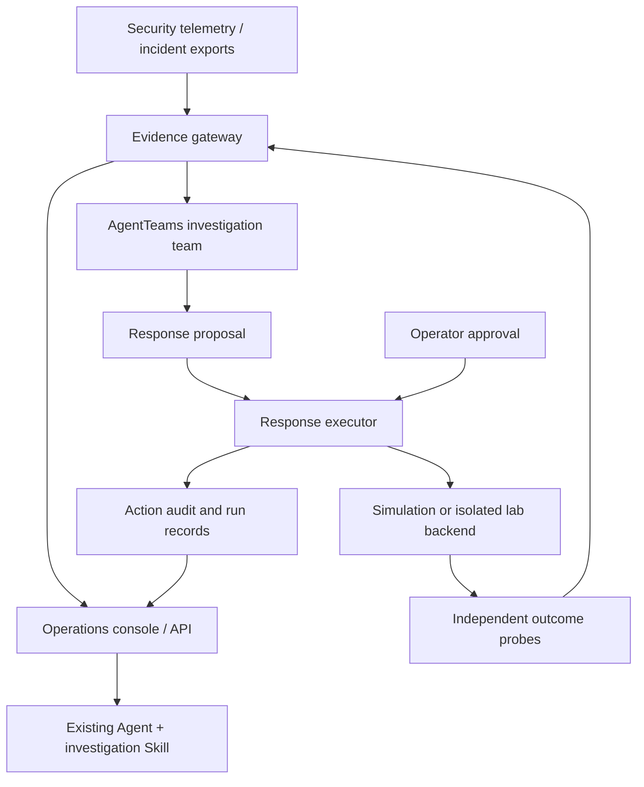

<p align="center">
  
</p>

<p align="center"><strong>English</strong> · <a href="README.zh-CN.md">简体中文</a></p>
<p align="center">
  <a href="https://github.com/elsechord/CyberGuard/actions/workflows/ci.yml"></a>
  <a href="LICENSE"></a>
  <a href="https://github.com/elsechord/CyberGuard/releases"></a>
</p>

**CyberGuard brings evidence, approval and outcome verification to Agent-assisted security operations.** Investigate an incident in your existing Agent, review response proposals in the console, and connect tools through the evidence gateway and response executor. [AgentTeams](https://github.com/agentscope-ai/AgentTeams) provides the multi-Agent collaboration foundation.

[Use with your Agent](#use-with-your-agent) · [Deploy the console](#deploy-the-console) · [See a complete example](#execution-succeeded-recovery-did-not) · [Integrate](#connect-your-existing-systems) · [Documentation](#documentation)

## What you can do

| Your task | CyberGuard provides | Start here |
| --- | --- | --- |
| Understand an incident in an existing Agent | Read-only incident access and a workflow for evidence-cited analysis | [Portable investigation Skill](docs/EXTERNAL_AGENT_SKILL.md) |
| Review a proposed response | A console for targets, reasons, approval decisions and incident history | [Operations console](docs/OPERATIONS_CONSOLE.md) |
| Check whether a response worked | Run-linked observations, execution records and verification results | [Real process laboratory](docs/HOST_LAB.md) |
| Bring existing security telemetry | Suricata file ingest and configurable read-only HTTP connectors | [Ingest](docs/INGEST.md) · [Connectors](docs/LIVE_CONNECTORS.md) |

## Use with your Agent

Keep your current Agent and model. The portable Skill reads CyberGuard incident exports or an authorized console API; the calling Agent performs the analysis. It needs file access and Python 3.10+, not a separate AgentTeams deployment.

**Copy this into your coding Agent:**

```text
Install the CyberGuard investigation Skill into my current project and complete
the offline first-use exercise.

Get https://github.com/elsechord/CyberGuard into a separate source directory,
preserve existing files, and record the checked-out commit. Read
docs/EXTERNAL_AGENT_SKILL.md and integrations/agent-skills/cyberguard/SKILL.md,
then inspect scripts/install-agent-skill.py before running it.

Use --agent codex for Codex, --agent claude for Claude Code, or --agent generic
for a compatible host; set --project to my existing project directory.
Do not overwrite an existing Skill installation.

Read the installed SKILL.md, create a new offline exercise snapshot, and analyze
whether high CPU usage alone establishes cryptomining. Cite evidence IDs,
explain what is still unknown, and suggest the next observation.
Label the input as synthetic and the analysis as performed by this Agent.
Do not deploy services, request a model key or execute remediation.
If the host cannot run this workflow, report the missing capability.
```

Or install from a checkout containing the package:

```bash
python scripts/install-agent-skill.py --agent codex --project /absolute/path/to/project
# For Claude Code, use --agent claude. The target project must already exist.
```

**First result:** an analysis that distinguishes observations from conclusions and cites the supplied evidence. The included exercise deliberately pairs high CPU usage with an authorized-workload inventory; the CLI creates and inspects the snapshot, while your Agent writes the analysis.

This entry point is **read-only**. It does not parse arbitrary log/PDF files, collect new host telemetry or execute a response. Installation layout and client behavior are tested; automatic discovery in each Agent application still needs host-specific verification. [Connect a real incident and check host requirements →](docs/EXTERNAL_AGENT_SKILL.md)

## Deploy the console

For analysts and teams who need an incident queue, approval screens, roles, API keys and an audit history.


With Git, Python 3.12+ and Docker Compose, run the following in Bash (Linux/macOS or Windows Git Bash):

```bash
git clone https://github.com/elsechord/CyberGuard.git
cd CyberGuard
python deploy/init_secrets.py
docker network inspect agentteams-net >/dev/null 2>&1 || docker network create agentteams-net
docker compose up -d --build
```

| Local entry | Purpose | Next step |
| --- | --- | --- |
| `http://127.0.0.1:18120` | Multi-user operations console | [Create the first administrator and configure HTTPS/sessions](docs/OPERATIONS_DEPLOY.md) |
| `http://127.0.0.1:18100/console` | Read-only evidence audit view | [Collect the first fixture evidence](docs/QUICKSTART.md) |

The queue starts empty. The default response backend is **simulation**; installing the stack does not grant it access to production equipment. Secure cookies are enabled by default, so complete the session configuration before using the operations console. [Full installation and troubleshooting →](docs/QUICKSTART.md)

## Execution succeeded. Recovery did not.

The Linux process lab demonstrates why an execution receipt is not an outcome check:

| Step | What happens |
| --- | --- |
| Observe | Collect a harmless experiment process and its persistence configuration. |
| Propose and approve | Bind approval to a specific process target. |
| Execute | The executor terminates that process successfully. |
| Verify | The supervisor restarts it. Independent observations return **failed**. |
| Propose again | A new proposal targets the persistence configuration and receives a new approval. |
| Verify again | The experiment process and persistence are absent during the observation window; the control workload continues. Result: **verified**. |

```bash
docker compose -f compose.host-lab.yaml up --build --abort-on-container-exit --exit-code-from host-lab
```

This is a real, isolated Linux process/file experiment with **scripted decisions and automated test approval**. It does not establish autonomous AI investigation or production recovery. An interactive operator-approval mode and evidence-export instructions are available in the [lab guide](docs/HOST_LAB.md).

Other ways to inspect the project:

- [Account lab](docs/LAB_EXECUTION.md): disable an isolated account, probe access independently, then restore it.
- [Recorded AgentTeams task](docs/LIVE_TASK_EVIDENCE.md): inspect native collaboration, proposals, approval records and target correction in a supply-chain exercise. Its execution/verification uses the scenario contract.
- [82-second service demo](https://github.com/elsechord/CyberGuard/releases/download/v0.14.1/cyberguard-demo-final.mp4): the published deterministic walkthrough. [Evidence bundle](https://github.com/elsechord/CyberGuard/releases/tag/v0.14.1). This is distinct from the process-recurrence lab above.

## Connect your existing systems

Start with the interface that matches your workflow:

| Integration | Input → output | Available today |
| --- | --- | --- |
| Existing Agent | CyberGuard incident JSON / authorized API → evidence for Agent analysis | Portable read-only Skill |
| IDS export | Suricata EVE JSON/JSONL → normalized evidence | [File ingest adapter](docs/INGEST.md) |
| SIEM / EDR / NDR / CMDB | Configured upstream HTTP response → incident evidence | [Server-owned connector configuration](docs/LIVE_CONNECTORS.md); vendor mappings need adaptation |
| Internal application | Scoped API request → incident, evidence and proposal data | [Console API v1](docs/OPERATIONS_CONSOLE.md#api-v1) |
| SOAR / device execution | Approved proposal → response action → outcome observation | Executor extension work; production vendor-specific mutating integrations are not included |

For example, read incidents from a deployed console using a key with `incidents:read` scope:

```bash
# Bash. Configure these environment variables locally; do not put keys in source.
curl --fail --silent --show-error \
  -H "Authorization: Bearer ${CYBERGUARD_CONSOLE_API_KEY}" \
  "${CYBERGUARD_CONSOLE_URL}/api/v1/incidents?limit=5"
```

List responses use `data`, `has_more` and `next_cursor`. Read one incident at `/api/v1/incidents/{incident_id}`. API keys are scoped but not a complete per-tenant isolation system. [Endpoints, authentication and errors →](docs/OPERATIONS_CONSOLE.md#api-v1)

## How the components fit



AgentTeams supplies orchestration, Matrix collaboration, shared storage and Skill distribution. CyberGuard adds security evidence tools, proposal-bound approvals, execution adapters and outcome observations. The portable investigation Skill is a separate, read-only entry point; it does not execute the response path in this diagram.

## Reuse and extend

- **Evidence:** normalization, source metadata, identifiers and citation checks. [Observation model](docs/OBSERVATION_MODEL.md) · [Contracts](contracts/)
- **Controlled actions:** allowlisted dispatch, proposal-bound approvals, idempotency and action audit records. [Executor](services/response-executor/) · [Threat model](docs/THREAT_MODEL.md)
- **Outcome checks:** account-access and process-state probes, run correlation and evidence export. [Run example](docs/examples/run-correlation-CG-2026-0002.md)
- **Agent integration:** [ten AgentTeams role Skills](docs/SKILL_CATALOG.md), the [portable Skill](integrations/agent-skills/cyberguard/), and [local AgentTeams setup](docs/AGENTTEAMS_LOCAL.md).
- **Optional model admission guard:** per-run budget reservations and role-bound routes. [Guard documentation](docs/MODEL_GUARD.md)

Security operations is the implemented application domain. Reusing these components for financial, legal or other workflows requires domain-specific evidence mappings, policies and effect checks; those integrations are not claimed here.

## Documentation

| Goal | Guide |
| --- | --- |
| Install or troubleshoot | [Quickstart](docs/QUICKSTART.md) · [Console deployment](docs/OPERATIONS_DEPLOY.md) |
| Investigate in your own Agent | [Skill setup and connection](docs/EXTERNAL_AGENT_SKILL.md) |
| Run a multi-Agent task | [AgentTeams bootstrap](agentteams/BOOTSTRAP.md) · [Local setup](docs/AGENTTEAMS_LOCAL.md) |
| Inspect the trust boundaries | [Threat model](docs/THREAT_MODEL.md) · [Live connectors](docs/LIVE_CONNECTORS.md) |
| Reproduce and evaluate | [Judge service checks](docs/JUDGE_DEMO.md) · [Investigation evaluation](docs/INVESTIGATION_EVALUATION.md) |
| Find releases and competition material | [Releases](https://github.com/elsechord/CyberGuard/releases) · [Competition guide](docs/COMPETITION.md) |

## Contributing

Useful contributions include sanitized integration examples, connector mappings, independent outcome probes and reproducible failure cases. Start with an [issue](https://github.com/elsechord/CyberGuard/issues) describing the input, expected result and reproduction steps. Do not include credentials or private telemetry.

For local tests, follow [the development instructions](docs/QUICKSTART.md). Run each test file in its own interpreter: several services use the same Python package name. CI is linked above. Upstream integration work includes the AgentTeams Worker console-binding [PR #1287](https://github.com/agentscope-ai/AgentTeams/pull/1287).

## License

[Apache-2.0](LICENSE). Third-party assets retain their respective licenses; typography notices for the README artwork are in [brand assets](docs/assets/brand/README.md).
