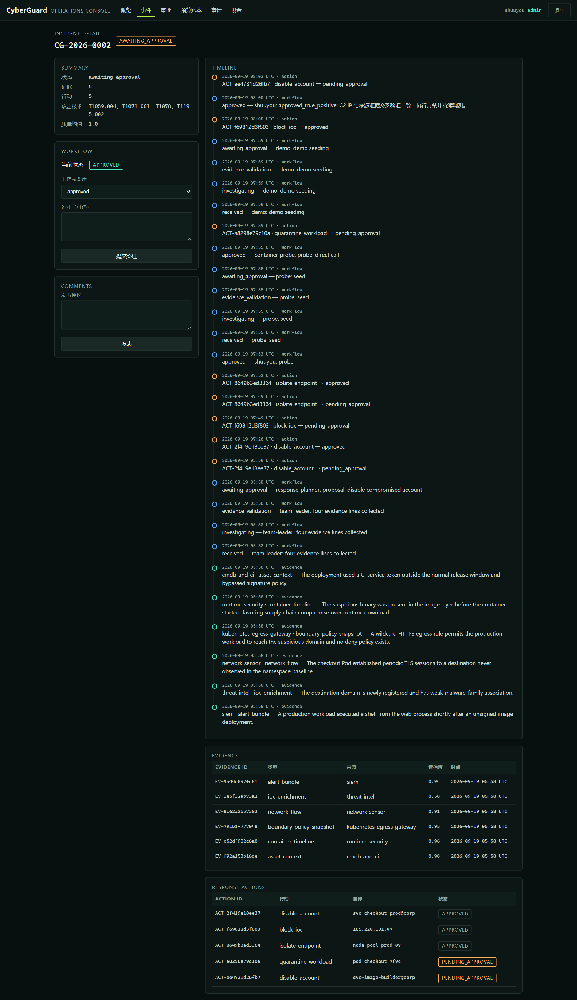
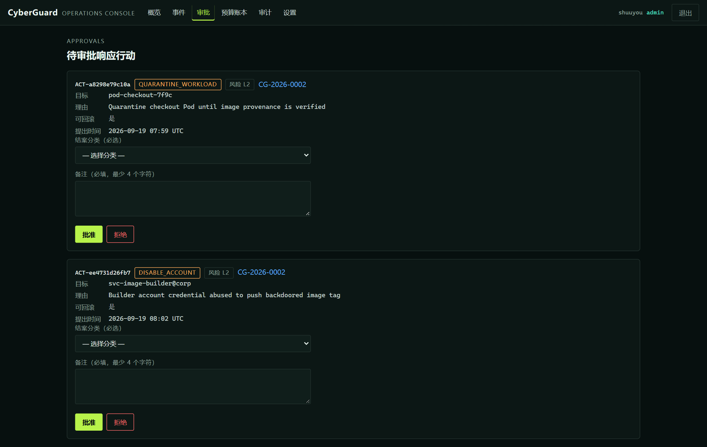
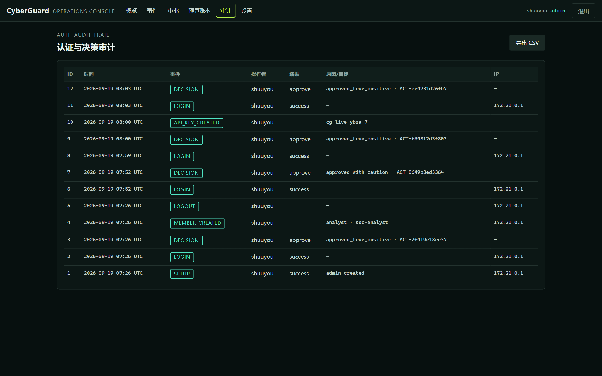
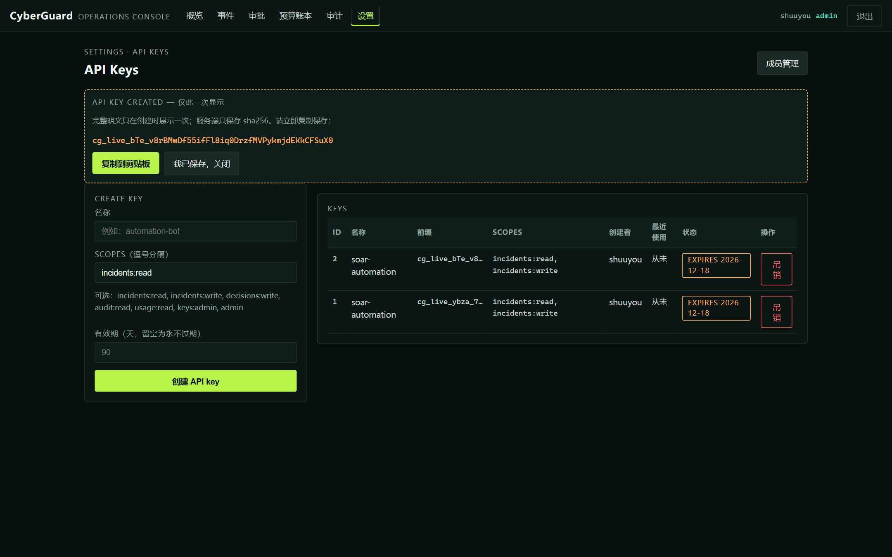

# CyberGuard

<picture>
  <source media="(prefers-color-scheme: dark)" srcset="docs/assets/elsechord-horizontal-light.png">
  
</picture>

[](https://github.com/elsechord/CyberGuard/actions/workflows/ci.yml)
[](https://github.com/elsechord/CyberGuard/releases/latest)
[](LICENSE)
[](https://www.python.org/)

**60-second demo (console walk-through):** [cyberguard-demo-60s.mp4](https://github.com/elsechord/CyberGuard/releases/download/v0.14.0/cyberguard-demo-60s.mp4) — release asset of [v0.14.0](https://github.com/elsechord/CyberGuard/releases/tag/v0.14.0).

CyberGuard is an evidence-driven autonomous security operations team built on [AgentTeams](https://github.com/agentscope-ai/AgentTeams). It coordinates specialized Agents for alert fusion, threat intelligence, network hunting, endpoint forensics, response planning, controlled execution and independent recovery verification.

The project is designed for the GOAI “Agent Infra 新智基座” track. It intentionally reuses AgentTeams for orchestration, Matrix collaboration, Skill distribution, shared storage and credential brokering, while CyberGuard provides the security-domain application layer.


*Signed-in overview: open incidents, actions awaiting approval, evidence volume and guard budget usage.*

## Three steps to run

**Path A — Docker Compose (recommended):**

```bash
git clone https://github.com/elsechord/CyberGuard.git && cd CyberGuard
python deploy/init_secrets.py      # writes .env with role-separated random secrets (stdlib only)
docker compose up -d --build       # gateway 127.0.0.1:18100, response executor 127.0.0.1:18105
```

**Path B — Python venv, no Docker** (Windows Git Bash verified):

```bash
git clone https://github.com/elsechord/CyberGuard.git && cd CyberGuard
python -m venv .venv
.venv/Scripts/python -m pip install -r services/security-tool-gateway/requirements.txt \
  -r services/response-executor/requirements.txt httpx
export PYTHONPATH="$PWD" CYBERGUARD_API_TOKEN=dev-read-token \
       CYBERGUARD_SCENARIO_DIR="$PWD/scenarios" CYBERGUARD_DATA_DIR="$PWD/tmp/data" \
       CYBERGUARD_KNOWLEDGE_DIR="$PWD/knowledge" && mkdir -p tmp/data
.venv/Scripts/python -m uvicorn app.main:app --app-dir services/security-tool-gateway \
  --host 127.0.0.1 --port 18100
```

Then open **http://127.0.0.1:18100/console**. The incident list starts empty; collect the first fixture evidence with `POST /tools/alert/snapshot` and the `Authorization: Bearer <CYBERGUARD_API_TOKEN from .env>` header (see the quickstart for the exact curl). Services bind to loopback only.

Measured on a fresh clone (2026-09-18): venv to first evidence in the console in **6 min 07 s**, including the full 23-file test suite. Full walkthrough, timings and troubleshooting: **[docs/QUICKSTART.md](docs/QUICKSTART.md)**.

### Prebuilt container images

Both services are built and pushed to GHCR by CI on every published release and on manual dispatch ([`publish-images.yml`](.github/workflows/publish-images.yml), `linux/amd64`):

```bash
docker pull ghcr.io/elsechord/cyberguard-gateway:sha-3b34e4c
docker pull ghcr.io/elsechord/cyberguard-executor:sha-3b34e4c
```

`sha-3b34e4c` is the tag pushed by the first verified dispatch run; release tags (`vX.Y.Z`) and `latest` are attached automatically on the next published release. The GHCR packages currently require a GitHub login with access to pull — flip visibility to public in the package settings if you are a maintainer.

> **GOAI 复赛（v0.13.0）**：真实 AgentTeams 原生任务证据包已发布 —— 一条 WebShell 供应链投毒事件（CG-2026-0002）从任务创建、四线并行调查、提案、人工审批（哈希绑定）、执行、双轮独立复测（inconclusive→verified）到回滚演示的完整闭环，含 2,992 条原生 Matrix 事件与 14 条 HMAC 链式审计记录。见 [release v0.13.0](https://github.com/elsechord/CyberGuard/releases/tag/v0.13.0) 与 [复现手册](docs/LIVE_TASK_EVIDENCE.md)。

## What is runnable today

- A read-only security evidence gateway with alert, intelligence, network, boundary-policy, endpoint, asset and recovery tools.
- Evidence 1.0 normalization with OCSF-aligned event classes, STIX 2.1 observable types, ATT&CK mappings, deterministic quality gates and cross-source entity correlation.
- A controlled response executor with an allowlist, idempotency, proposal-bound approval, HMAC-authenticated audit records/checkpoints and rollback. The lab backend persists dispatch intent and reconciles uncertain outcomes; it requires a single executor process.
- A loopback identity laboratory with real SQLite account mutations, separate account-access probes, durable operation receipts and restart/lost-response tests.
- Reproducible credential-compromise and supply-chain compromise scenarios, including adversarial tool output.
- Seven Agent role definitions and ten reusable AgentTeams Skills, including explicit boundary-defense analysis.
- Server-owned live SIEM/NDR/EDR/CMDB connector contracts that keep destinations and credentials away from Agents.
- A read-only evidence audit console for incident status, evidence graphs, approvals, action history and verification.
- Evidence and incident JSON contracts.
- AgentTeams v1.2.2 server configuration and bootstrap instructions.
- Local unit tests and server-side Docker smoke tests.

The response executor defaults to **simulation**. Opt-in **lab** mode really disables and restores one account in an isolated local identity service. It does not operate a production identity provider. Live investigation connector contracts are implemented; vendor-specific mutating integrations remain future work.

### Operations console

The bundled operations console turns CyberGuard into a deployable multi-user product surface rather than a demo page: server-side sessions with PBKDF2 password hashing, four-tier RBAC (viewer / analyst / approver / admin, deny-by-default), API keys with scoped Bearer access to a versioned JSON API, and an append-only decision audit with CSV export. It ships as a hardened container in the same `compose.yaml` as the rest of the stack.



*Per-incident workflow timeline interleaving agent events, evidence records and response-action state, with the current workflow state derived from the audit trail.*



*A proposed response action held until an approver records a mandatory closure classification and written justification; approving also advances the gateway workflow so the incident leaves `awaiting_approval`.*



*Authentication and decision audit trail: setup, logins, approvals (with action id) and key management, exportable as CSV.*



*Scoped API keys: `cg_live_` secrets shown once, stored as sha256, with expiry and revocation.*

### Reproduce the real account laboratory

After installing the dependencies in [the lab runbook](docs/LAB_EXECUTION.md), run:

```bash
python scripts/lab-demo.py
```

This starts three loopback services, demonstrates proposal/approval/disable/independent verification/rollback, then stops them. A checksummed evidence directory is written under `artifacts/lab/`. The harness is deterministic and supplies its own approval credential: **it is not an AgentTeams/LLM run or evidence of actual human review**. See the runbook for failure semantics and the integration tests for response-loss recovery.

For the isolated Docker version, run `docker compose -f compose.lab.yaml up --build --abort-on-container-exit --exit-code-from lab`. It uses a non-root container with no external network and a read-only root filesystem. See the runbook to copy out evidence and run fault tests. The console now supports run-scoped evidence, authenticated action snapshots, mode/probe details and JSON exports.

### Reproduce incomplete cleanup and process recurrence

```bash
docker compose -f compose.host-lab.yaml up --build --abort-on-container-exit --exit-code-from host-lab
```

The [Linux process lab](docs/HOST_LAB.md) starts harmless real processes in an offline container. An approved process termination is followed by an actual supervisor restart; independent observations reject recovery. A separately approved, version-bound persistence cleanup is then checked over a bounded time window while a control workload keeps progressing. The console and run export retain both outcomes. The workflow is scripted, and automated approval is explicitly labeled; an optional interactive approval mode is available. This is not a real mining intrusion, an AgentTeams run, or proof of autonomous reasoning.

### Evidence-bound investigation

The [investigation pipeline](docs/INVESTIGATION_PIPELINE.md) accepts immutable evidence bundles and produces cited reports through a read-only API and a separate report-submission credential. The Linux collector records collection gaps; the fixed-rule baseline preserves uncertainty about malware, initial access and attribution. Three labeled exercise cases and a separate evaluator are included. The [model runner](docs/INVESTIGATION_EVALUATION.md) supports actual bounded single-agent tool calls and retains failed attempts, raw responses and provider usage. AgentTeams task/MCP preparation is separate; neither a direct model call nor an accepted report proves AgentTeams execution.

Run `docker compose -f compose.investigation.yaml up --build --abort-on-container-exit --exit-code-from investigation` to exercise the HTTP pipeline and collect the current isolated Linux container. The image excludes exercise answer keys and performs no remediation.

For actual local orchestration, see [AgentTeams on Docker Desktop](docs/AGENTTEAMS_LOCAL.md). This deployment uses a documented, locally built controller patch to bind Worker consoles to localhost. It is an integration environment; service health and Worker readiness do not establish task completion or comparative effectiveness.

The experimental [model admission guard](docs/MODEL_GUARD.md) reserves per-run budgets before provider dispatch, authenticates role-bound model routes, rejects exact duplicate requests, and retains unknown usage after failures. The [fresh-Worker integration procedure](docs/AGENTTEAMS_GUARDED_LOCAL.md) verifies native tools and route isolation while the guard is disarmed. Its serial three-Worker harness tests integration; it does not establish autonomous orchestration or a multi-agent performance advantage.

## Architecture

```text
Human / SOC analyst
        │ Matrix approval and intervention
        ▼
AgentTeams Team Leader
        │
        ├── Alert Fusion ──┐
        ├── Threat Intel ──┤
        ├── Network Hunter ├── Evidence IDs + competing hypotheses
        └── Endpoint IR ───┘
                           │
             Standard observation + quality gate
                           │
              Entity / observable correlation graph
                           │
                    Response Planner
                           │ proposal
                           ▼
                 Controlled Responder ── human approval gate
                           │
                    Recovery Verifier
                           │
                 Auditable incident report

AgentTeams: orchestration, Matrix, MinIO, Higress, Skills, lifecycle
CyberGuard: security tools, evidence model, response policy, scenarios, evaluation
```

## Agent Infra Primitives

The governance core below is domain-agnostic by construction — security is simply its first tenant. Each layer is reusable for any agent workload that needs controlled side effects, normalized evidence, model budgets or run-bound verification.

| Primitive | What it does | Where |
|---|---|---|
| Controlled side-effect execution kernel | Proposal → human approval → idempotent allowlisted dispatch → HMAC-chained audit records and checkpoints → rollback, with reconciliation of uncertain outcomes | `services/response-executor/app/main.py` |
| Observation / Evidence contract layer | OCSF/STIX-aligned normalization, deterministic quality gates and cross-source entity correlation behind one read-only tool surface | `services/security-tool-gateway/app/normalization.py`, `contracts/` |
| Model admission guard | Reserves per-run token budgets before provider dispatch, authenticates role-bound model routes, rejects exact duplicate requests, retains unknown usage after failures | `cyberguard_investigation/model_guard.py` |
| Run-bound verification harness | Deterministic scenario fixtures, independent recovery probes and repeatable benchmark runs inside isolated Compose labs | `benchmark/`, `compose.lab.yaml`, `compose.host-lab.yaml` |

## Upstream

Running CyberGuard on real AgentTeams v1.2.2 deployments surfaced three issues that received substantive maintainer replies: MCP tool-service registration friction ([#1284](https://github.com/agentscope-ai/AgentTeams/issues/1284)), cumulative Worker input-token budgets ([#1285](https://github.com/agentscope-ai/AgentTeams/issues/1285)) and driver-policy denial plus Worker console port exposure ([#1286](https://github.com/agentscope-ai/AgentTeams/issues/1286)). The console-binding patch offered in #1286 became [PR #1287](https://github.com/agentscope-ai/AgentTeams/pull/1287), which a maintainer approved and merged into AgentTeams main on 2026-09-18. In #1285 the maintainers confirmed that per-request context limits cannot enforce a cumulative run budget — admission plus reservation, the mechanism CyberGuard's model admission guard already implements, is required.

## Local development without Docker

The step-by-step quickstart for the Python-only path — venv, dependency install
(the hash lock targets Linux x86_64; Windows falls back to the unhashed service
requirements), the one-file-per-interpreter test suite, gateway/executor startup
on loopback and port map — lives in **[docs/QUICKSTART.md](docs/QUICKSTART.md)**.
On Windows you can also run `powershell -ExecutionPolicy Bypass -File
scripts/test-local.ps1`; on Linux `bash scripts/test-local.sh`. Run test files
one per interpreter: both services expose an `app` package, so collecting the
whole suite in a single `pytest tests/` process is not supported.

## Fast server deployment

Recommended host: Ubuntu 22.04/24.04 x86_64, 8 CPU cores, 16 GB RAM, 100 GB SSD, Docker Engine and outbound access to the selected LLM provider. The current hash-locked Python wheel set intentionally targets Linux x86_64.

1. Upload this repository to `/srv/cyberguard`.
2. Copy `deploy/agentteams/agentteams.env.example` to `/srv/cyberguard/agentteams.env` and fill the model API values and strong admin password.
3. Run the single bootstrap and acceptance entry point:

   ```bash
   cd /srv/cyberguard
   chmod +x deploy/*.sh scripts/*.sh tests/*.sh
   sudo ./deploy/bootstrap-server.sh
   ```

   It checks Linux/Docker/resources, atomically creates `.env` with five role-separated random secrets and mode `0600`, validates both configuration files without exposing secret values, installs the pinned AgentTeams release if needed, builds CyberGuard, proves the response lifecycle and creates a timestamped checksummed archive under `artifacts/acceptance/`.

4. For a remote server, forward the loopback-only audit console and open `http://127.0.0.1:18100/console`:

   ```bash
   ssh -L 18100:127.0.0.1:18100 user@your-server
   ```

5. Register the two tool services without placing credentials in Matrix, then run `sudo bash deploy/bootstrap-agentteams.sh`. It distributes Skills and creates/validates the Team through the pinned v1.2.2 Manager workflow. See [AgentTeams bootstrap](agentteams/BOOTSTRAP.md).

6. Run `sudo bash deploy/competition-readiness.sh`, then send [the demo incident](agentteams/demo-task.md) to the `cyberguard-soc` Team Leader.

For the judged deterministic demonstration, run `sudo bash deploy/judge-demo.sh`. It executes both attack scenarios and emits a machine-readable result plus checksums under `artifacts/demo/`; see [the 90-second judge runbook](docs/JUDGE_DEMO.md).

To reproduce the live AgentTeams task evidence (native Matrix event chain, approval, execution, re-verification, rollback), follow [docs/LIVE_TASK_EVIDENCE.md](docs/LIVE_TASK_EVIDENCE.md) and use `scripts/capture-agentteams-task.py`.

The audit console is deliberately read-only and complementary to Matrix: AgentTeams remains the collaboration and human-intervention surface, while the console gives judges a compact view of evidence and response provenance.

## Security boundaries

- Investigation tools are read-only and isolated from the response service.
- Workers receive gateway consumer credentials, not upstream secrets.
- The approval secret is human-controlled and must never be assigned to an Agent.
- The audit HMAC key remains executor-only; the gateway receives only a read-only verification token.
- Services run as non-root, read-only containers with all Linux capabilities dropped.
- Services bind only to loopback on the host and are also reachable from `agentteams-net` by container DNS.
- The host share directory is intentionally narrow; do not mount a user home or `/`.
- AgentTeams’ Docker access remains a privileged control-plane capability and should run on a dedicated host.

See [the threat model](docs/THREAT_MODEL.md) for trust boundaries and failure handling.
See [the security observation model](docs/OBSERVATION_MODEL.md) for normalization, quality scoring and correlation semantics.

## Repository layout

```text
agentteams/     Team creation and demo messages
contracts/      Evidence and incident schemas
deploy/         AgentTeams and CyberGuard server deployment
docs/           Architecture, threat model and operations
scenarios/      Deterministic incident fixtures
services/       Read-only tool gateway and response executor
skills/         Reusable AgentTeams Skill packages
tests/          Unit and Docker smoke tests
```

## Competition deliverables

- **v0.13.0 release**: 真实 AgentTeams 任务证据包（tar.gz + SHA256）与复现手册——评委核验入口。
- `dist/CyberGuard-server-v0.11.0.zip`: upload-ready server bundle.
- `dist/CyberGuard-GOAI-初赛方案-v0.11.0.pptx`: 19-slide preliminary submission based on the official template.
- `dist/CyberGuard-GOAI-preliminary-v0.11.0.pptx`: ASCII-named copy included in the server bundle for Windows tar compatibility.
- `dist/CyberGuard-source-v0.11.0.spdx.json`: deterministic SPDX 2.3 source and dependency SBOM.
- `dist/skills/`: ten individually packaged Skills plus `SHA256SUMS`.

The deck labels container/model runs as pending until reproduced on the target server. Do not replace those labels with performance claims until `deploy/deploy-cyberguard.sh`, `tests/e2e_demo.sh`, and the four benchmark variants have produced retained evidence.

## Validation

Every push and pull request runs the same deterministic tests, validates Compose, builds both images, fails on fixed HIGH/CRITICAL findings, and publishes source plus container SPDX SBOMs. Third-party Actions are pinned to full commit SHAs and repository permissions are read-only.

The local suite includes real HTTP laboratory integration tests. Install service dependencies and `tests/requirements.lock` first; platform-specific instructions are in [the lab runbook](docs/LAB_EXECUTION.md). Docker smoke tests still exercise the default simulation configuration.

On Windows development hosts:

```powershell
powershell -ExecutionPolicy Bypass -File scripts/test-local.ps1
```

Run test files one per interpreter (both services expose an `app` package, so a single `pytest tests/` collection is not supported):

```bash
for f in tests/test_*.py; do .venv/Scripts/python "$f" || break; done
```

On the Linux server, `deploy/deploy-cyberguard.sh` validates Compose, builds all images, starts the stack and runs a cross-service incident. The E2E gate proves that recovery is inconclusive before action, unapproved execution is rejected, approved execution changes verification state, the audit chain is valid, and rollback is observed.

## License

Apache-2.0. Security data and third-party connectors may carry their own licenses; do not add proprietary telemetry to the public repository.
