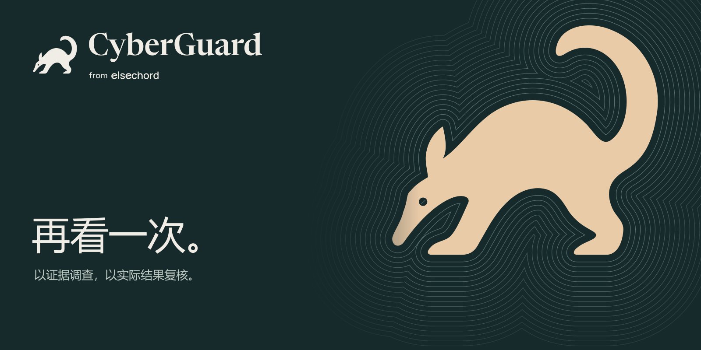
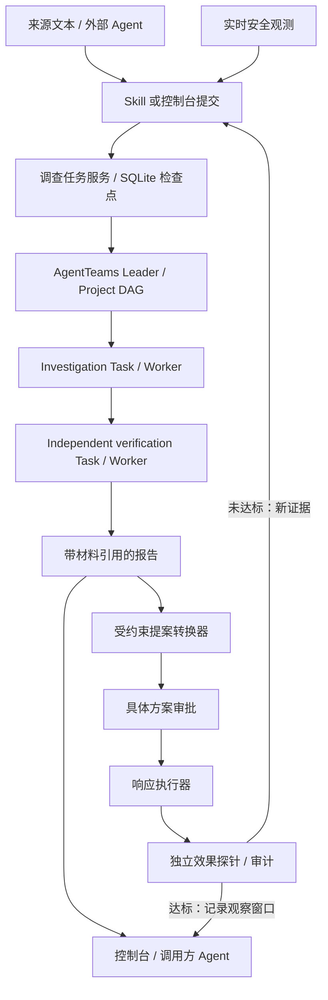

<p align="center">
  
</p>

<p align="center"><a href="README.md">English</a> · <strong>简体中文</strong></p>
<p align="center">
  <a href="https://github.com/elsechord/CyberGuard/actions/workflows/ci.yml"></a>
  <a href="LICENSE"></a>
  <a href="https://github.com/elsechord/CyberGuard/releases"></a>
</p>

**让 Agent 的调查有据可查，让处置结果经得起复核。**

CyberGuard 是面向 Agent 的调查与处置治理基础设施。已有 Agent 通过 Skill 提交材料，AgentTeams 规划任务、组织调查与独立复核，结果带着原文引用返回。安全团队可进一步使用提案绑定审批、执行与效果探针，把“命令执行成功”与“问题真正解决”分开判断。

[新版演示视频](https://github.com/elsechord/CyberGuard/releases/download/v0.15.0/cyberguard-finals-20260920.mp4) · [决赛演示入口](docs/FINALS_ENTRY.md) · [亮点与证据](docs/PROVEN_CAPABILITIES.md) · [部署并连接 Agent](#部署控制台) · [文档导航](#文档导航)

**最新实跑：** 同一合成挖矿案件、相同配置，连续两次完成 Skill → AgentTeams 原生任务 → 调查 → 独立复核 → 报告交付，耗时 **5 分 7 秒 / 3 分 52 秒**。两次都识别出：第一轮停止进程成功，仍未达到清除目标；第二轮只在已有观察窗口内达标。[原始报告、任务记录与复查结果 →](docs/FULL_CASE_VALIDATION.md)

## 你可以用它做什么

| 你的任务 | CyberGuard 提供什么 | 从这里开始 |
| --- | --- | --- |
| 从已有 Agent 委托调查 | 生成连接指令、提交材料并获取后端报告 | [连接你的 Agent](docs/EXTERNAL_AGENT_SKILL.md#从控制台连接推荐) |
| 审查一次处置建议 | 查看目标、理由、审批决策与事件历史 | [运营控制台](docs/OPERATIONS_CONSOLE.md) |
| 确认处置是否有效 | 按运行关联观测、执行记录与复核结果 | [真实进程实验](docs/HOST_LAB.md) |
| 接入已有安全数据 | Suricata 文件导入与可配置的只读 HTTP 连接器 | [数据导入](docs/INGEST.md) · [连接器](docs/LIVE_CONNECTORS.md) |

## 部署控制台

**要部署完整的原生调查后端：** 按[从零部署指南](docs/NATIVE_INSTALL.md)，从固定 AgentTeams 版本到第一份 Skill 调查逐步完成。下面的命令先启动基础控制台。

适合需要事件队列、审批界面、角色权限、API Key 和审计历史的分析师与团队。


准备 Git、Python 3.12+ 与 Docker Compose，在 Bash 中运行（Linux/macOS 或 Windows Git Bash）：

```bash
git clone https://github.com/elsechord/CyberGuard.git
cd CyberGuard
python deploy/init_secrets.py
docker network inspect agentteams-net >/dev/null 2>&1 || docker network create agentteams-net
CYBERGUARD_COOKIE_SECURE=false docker compose up -d --build
```

该命令用于本机 HTTP 会话；公网部署按[部署指南](docs/OPERATIONS_DEPLOY.md)启用 HTTPS，并保留 Secure Cookie。

| 本机入口 | 用途 | 下一步 |
| --- | --- | --- |
| `http://127.0.0.1:18120` | 多用户运营控制台 | [创建首个管理员，完成 HTTPS 与会话配置](docs/OPERATIONS_DEPLOY.md) |
| `http://127.0.0.1:18100/console` | 只读证据审计视图 | [采集第一份演练证据](docs/QUICKSTART.md) |

基础部署包含控制台与模拟响应后端。完成管理员、HTTPS 会话配置后，按[从零部署指南](docs/NATIVE_INSTALL.md)连接 AgentTeams 与模型，即可运行真实调查。

**随后连接你的 Agent：** 打开 `/connect`，生成 Skill v0.2.0 连接提示词和调查 API Key，将密钥保存到 Agent 主机的私有文件。Agent 安装 Skill、检查连接后，就能按你的要求提交材料、查询任务并取回报告。[连接指南 →](docs/EXTERNAL_AGENT_SKILL.md)

也可以在 `/investigations` 直接提交文本或多材料 JSON。日志、财务记录、审计报告和司法文书采用统一材料格式，支持纯文本、JSON、CSV、Markdown，原文与提交者解释分别保留。[材料格式与领域适配 →](docs/INVESTIGATION_TASKS.md)

SQLite 队列与阶段检查点让调查在调用方 Agent 断开后继续推进；Console 展示等待、运行、失败和交付状态。[后端配置与任务控制 →](docs/AGENTTEAMS_TASK_SERVICE.md)

## 在已有 Agent 中使用

保留当前 Agent 作为交互入口。Skill 的主要职责是委托后端：提交已授权材料、查看任务状态并获取报告。客户端需要文件访问与 Python 3.10+，AgentTeams 运行时及模型配置由部署端提供。

**复制下面的提示词，发送给你的 Coding Agent：**

```text
请在当前项目配置 CyberGuard Skill v0.2.0，并验证控制台连接。
从 https://github.com/elsechord/CyberGuard 获取源码到独立目录，记录提交版本，
阅读 docs/EXTERNAL_AGENT_SKILL.md 和 integrations/agent-skills/cyberguard/SKILL.md，
检查 scripts/install-agent-skill.py 后再使用。按宿主选择 --agent codex、
--agent claude 或 --agent generic，--project 指向当前项目。
复用兼容安装，不覆盖已有文件。使用 /connect 提供的控制台地址和私有密钥文件路径，
运行 check --investigations 并报告真实结果；缺少配置时说明需要什么。
本次安装连接不授权上传材料、启动调查、部署服务或执行处置。
```

也可以从源码目录安装：

```bash
python scripts/install-agent-skill.py --agent codex --project /absolute/path/to/project
# Claude Code 改为 --agent claude，目标项目须已存在。
```

**还没有控制台？** 先用[合成离线演练](docs/EXTERNAL_AGENT_SKILL.md#离线试用复制这段提示词)体验证据分析，随后连接在线后端运行原生任务。已有事件包也可通过 `check` / `fetch` 读取。

## 执行成功，不代表已经恢复

**同一现场案件已经贯通：** 实时进程证据进入 AgentTeams 原生调查，报告转换为受约束提案；批准执行后，独立采样发现复发，新的证据再次进入原生调查，再提案、再批准、再验证。一次 **11 分 18 秒**的运行通过 **20 项检查**，两轮调查各由不同 Worker 完成调查与复核。[完整原始记录与运行方法 →](docs/LIVE_RESPONSE_DEMO.md)

Linux 进程实验展示了一个具体问题：结束进程成功之后，持久化机制仍可能把它重新启动。

| 步骤 | 实际发生什么 |
| --- | --- |
| 观察 | 采集无害实验进程及其持久化配置。 |
| 提案与审批 | 审批绑定到具体进程目标。 |
| 执行 | 执行器成功结束该进程。 |
| 复核 | 监督器重新拉起进程，独立观测判为 **failed**。 |
| 再次提案 | 新方案转向持久化配置，重新获得审批。 |
| 再次复核 | 观察窗口内，实验进程与持久化均不存在，正常对照任务继续运行，结果为 **verified**。 |

演示在隔离 Linux 环境中操作无害进程和真实文件；已发布记录使用测试审批，现场可选择交互批准。[运行动态提案演示 →](docs/LIVE_RESPONSE_DEMO.md)

<details>
<summary>历史演练与组件验收</summary>

- [固定流程进程实验](docs/HOST_LAB.md)：脚本预设两轮决策，用于复核与审批组件回归。
- [账号实验](docs/LAB_EXECUTION.md)：禁用隔离账号、独立探测访问，再恢复。
- [早期原生任务记录](docs/LIVE_TASK_EVIDENCE.md)：供应链演练中的协作与目标纠正。
- [v0.14.1 服务演示与证据包](https://github.com/elsechord/CyberGuard/releases/tag/v0.14.1)。

</details>

## 接入现有系统

根据已有工作流选择入口：

| 接入对象 | 输入 → 输出 | 当前交付 |
| --- | --- | --- |
| 已有 Agent／内部应用 | 已授权材料与目标 → 持久化任务 → 后端报告 | [Skill v0.2.0](docs/EXTERNAL_AGENT_SKILL.md) · [任务 API](docs/INVESTIGATION_TASKS.md) |
| 既有事件包 | 事件 JSON／只读 API → 本地审阅材料 | 旧 `check` / `fetch` |
| IDS 导出 | Suricata EVE JSON／JSONL → 规范化证据 | [文件导入适配器](docs/INGEST.md) |
| SIEM／EDR／NDR／CMDB | 配置的上游 HTTP 响应 → 事件证据 | [服务端连接器配置](docs/LIVE_CONNECTORS.md)，厂商字段需适配 |
| 内部应用 | 限定 scope 的 API 请求 → 事件、证据和提案数据 | [控制台 API v1](docs/OPERATIONS_CONSOLE.md#api-v1) |
| SOAR／设备处置 | 已审批提案 → 执行动作 → 效果观测 | 需要扩展执行器；尚未交付生产厂商的写操作集成 |

例如，使用具有 `incidents:read` 权限的 API Key，从已部署控制台读取事件：

```bash
# Bash：在本地配置环境变量，不要把密钥写进源码。
curl --fail --silent --show-error \
  -H "Authorization: Bearer ${CYBERGUARD_CONSOLE_API_KEY}" \
  "${CYBERGUARD_CONSOLE_URL}/api/v1/incidents?limit=5"
```

列表响应包含 `data`、`has_more`、`next_cursor`；单个事件通过 `/api/v1/incidents/{incident_id}` 读取。API Key 按 scope 控制接口权限。[接口、鉴权与错误处理 →](docs/OPERATIONS_CONSOLE.md#api-v1)

## 各组件如何协作



AgentTeams 负责原生调查与独立复核；受约束转换器将报告与实时目标映射为执行器允许的提案。方案经过审批后执行，新的效果观测决定是否重新调查。同案实跑使用隔离 Linux 环境中的无害进程与测试审批，现场可切换为交互批准。[完整链路 →](docs/LIVE_RESPONSE_DEMO.md)

## 复用与扩展

- **按需协作**：调查 Worker 可展开临时专家，支持定向问答和原生回收。[研究取舍](docs/ADAPTIVE_AGENT_RESEARCH.md) · [实际验证](docs/ADAPTIVE_COLLABORATION_VALIDATION.md)

- **证据组织**：规范化、来源信息、标识与引用校验。[观测模型](docs/OBSERVATION_MODEL.md) · [数据契约](contracts/)
- **受控动作**：允许列表、提案绑定审批、幂等执行与动作审计。[执行器](services/response-executor/) · [威胁模型](docs/THREAT_MODEL.md)
- **效果检查**：账号权限与进程状态探测、运行关联和证据导出。[运行关联示例](docs/examples/run-correlation-CG-2026-0002.md)
- **Agent 接入**：[十个 AgentTeams 角色 Skill](docs/SKILL_CATALOG.md)、[外部调查 Skill](integrations/agent-skills/cyberguard/)与[本机 AgentTeams 部署](docs/AGENTTEAMS_LOCAL.md)。
- **可选模型准入控制**：按运行预留预算，按角色约束模型路由。[Model Guard](docs/MODEL_GUARD.md)

安全是首个落地场景。财务、法律等文本可复用材料接入与审阅流程，进一步的专业解释、策略和效果判定通过领域适配扩展。

## 文档导航

| 我想做什么 | 文档 |
| --- | --- |
| 安装与排障 | [快速开始](docs/QUICKSTART.md) · [控制台部署](docs/OPERATIONS_DEPLOY.md) |
| 从自己的 Agent 委托调查 | [Skill 安装与连接](docs/EXTERNAL_AGENT_SKILL.md) · [任务与材料](docs/INVESTIGATION_TASKS.md) · [后端配置](docs/AGENTTEAMS_TASK_SERVICE.md) |
| 运行多 Agent 任务 | [AgentTeams 初始化](agentteams/BOOTSTRAP.md) · [本机部署](docs/AGENTTEAMS_LOCAL.md) |
| 了解权限与信任边界 | [威胁模型](docs/THREAT_MODEL.md) · [实时连接器](docs/LIVE_CONNECTORS.md) |
| 复现与评测 | [服务验收](docs/JUDGE_DEMO.md) · [调查评测](docs/INVESTIGATION_EVALUATION.md) |
| 查找版本与比赛材料 | [Releases](https://github.com/elsechord/CyberGuard/releases) · [比赛说明](docs/COMPETITION.md) |

## 参与贡献

欢迎提交脱敏接入示例、连接器字段映射、独立效果探针和可复现的失败案例。可以先在 [Issues](https://github.com/elsechord/CyberGuard/issues) 说明输入、预期结果与复现步骤，请勿附带凭据或私有安全数据。

本地测试见[开发说明](docs/QUICKSTART.md)。多个服务使用相同的 Python 包名，请将测试文件分别放在独立解释器中执行。CI 入口位于页面顶部。上游集成贡献包括 AgentTeams Worker 控制台绑定修复 [PR #1287](https://github.com/agentscope-ai/AgentTeams/pull/1287)。

## 许可证

[Apache-2.0](LICENSE)。第三方资产保留各自许可；README 海报使用的字体说明见[品牌资产目录](docs/assets/brand/README.md)。
