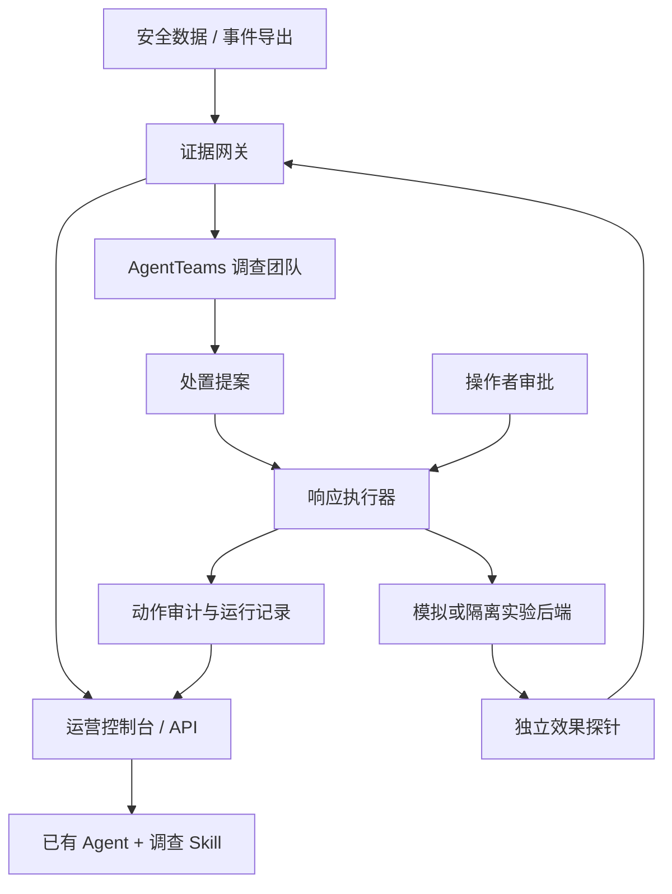

<p align="center">
  
</p>

<p align="center"><a href="README.md">English</a> · <strong>简体中文</strong></p>
<p align="center">
  <a href="https://github.com/elsechord/CyberGuard/actions/workflows/ci.yml"></a>
  <a href="LICENSE"></a>
  <a href="https://github.com/elsechord/CyberGuard/releases"></a>
</p>

**CyberGuard 为 Agent 辅助的安全运营提供证据、审批和结果复核能力。** 在已有 Agent 中分析事件，在控制台审查处置提案，通过证据网关和执行器接入工具。多 Agent 协作基于 [AgentTeams](https://github.com/agentscope-ai/AgentTeams)。

[在已有 Agent 中使用](#在已有-agent-中使用) · [部署控制台](#部署控制台) · [查看完整案例](#执行成功不代表已经恢复) · [接入现有系统](#接入现有系统) · [文档导航](#文档导航)

## 你可以用它做什么

| 你的任务 | CyberGuard 提供什么 | 从这里开始 |
| --- | --- | --- |
| 在已有 Agent 中调查事件 | 只读访问事件，按证据引用形成分析 | [外部调查 Skill](docs/EXTERNAL_AGENT_SKILL.md) |
| 审查一次处置建议 | 查看目标、理由、审批决策与事件历史 | [运营控制台](docs/OPERATIONS_CONSOLE.md) |
| 确认处置是否有效 | 按运行关联观测、执行记录与复核结果 | [真实进程实验](docs/HOST_LAB.md) |
| 接入已有安全数据 | Suricata 文件导入与可配置的只读 HTTP 连接器 | [数据导入](docs/INGEST.md) · [连接器](docs/LIVE_CONNECTORS.md) |

## 在已有 Agent 中使用

保留你现在使用的 Agent 和模型。外部 Skill 读取 CyberGuard 事件导出或已授权的控制台 API，由当前 Agent 完成分析。需要文件访问与 Python 3.10+，不必另外部署 AgentTeams。

**复制下面的提示词，发送给你的 Coding Agent：**

```text
请把 CyberGuard 调查 Skill 安装到我当前项目，并完成一次离线首次使用演练。

从 https://github.com/elsechord/CyberGuard 获取源码到独立目录，保留已有文件，
记录实际检出的提交版本。先阅读 docs/EXTERNAL_AGENT_SKILL.md 和
integrations/agent-skills/cyberguard/SKILL.md，检查 scripts/install-agent-skill.py。

Codex 使用 --agent codex，Claude Code 使用 --agent claude，
其他兼容宿主使用 --agent generic；--project 指向我已有的项目目录。
不要覆盖已安装的 Skill。

安装后读取实际安装位置的 SKILL.md，生成新的离线演练快照，分析：
仅凭 CPU 占用高，能否认定挖矿？引用 evidence_id，说明还缺什么证据，
并给出下一步最值得做的观察。注明输入为合成演练，分析由当前 Agent 完成。
不要部署服务、索要模型密钥或执行处置。
如果宿主无法运行此流程，请说明缺少的能力。
```

也可以在包含本接入包的源码目录中安装：

```bash
python scripts/install-agent-skill.py --agent codex --project /absolute/path/to/project
# Claude Code 改为 --agent claude；目标项目目录必须已经存在。
```

**第一次使用的结果：** 得到一份区分事实与判断、带证据引用的分析。随附演练同时提供“CPU 占用高”与“资产清单中有授权任务”的材料；CLI 负责生成、检查快照，分析由你的 Agent 撰写。

这个入口目前是**只读调查**：不直接解析任意日志或 PDF，不向主机采集新数据，也不执行处置。安装目录与客户端行为已有测试；各 Agent 应用内的自动发现仍需分别验证。[接入真实事件与宿主要求 →](docs/EXTERNAL_AGENT_SKILL.md)

## 部署控制台

适合需要事件队列、审批界面、角色权限、API Key 和审计历史的分析师与团队。


准备 Git、Python 3.12+ 与 Docker Compose，在 Bash 中运行（Linux/macOS 或 Windows Git Bash）：

```bash
git clone https://github.com/elsechord/CyberGuard.git
cd CyberGuard
python deploy/init_secrets.py
docker network inspect agentteams-net >/dev/null 2>&1 || docker network create agentteams-net
docker compose up -d --build
```

| 本机入口 | 用途 | 下一步 |
| --- | --- | --- |
| `http://127.0.0.1:18120` | 多用户运营控制台 | [创建首个管理员，完成 HTTPS 与会话配置](docs/OPERATIONS_DEPLOY.md) |
| `http://127.0.0.1:18100/console` | 只读证据审计视图 | [采集第一份演练证据](docs/QUICKSTART.md) |

初始队列为空。响应执行器默认使用**模拟后端**，启动服务不代表已取得生产设备的处置权限。控制台默认启用 Secure Cookie，请先完成会话配置。[完整安装与排障 →](docs/QUICKSTART.md)

## 执行成功，不代表已经恢复

Linux 进程实验展示了一个具体问题：结束进程成功之后，持久化机制仍可能把它重新启动。

| 步骤 | 实际发生什么 |
| --- | --- |
| 观察 | 采集无害实验进程及其持久化配置。 |
| 提案与审批 | 审批绑定到具体进程目标。 |
| 执行 | 执行器成功结束该进程。 |
| 复核 | 监督器重新拉起进程，独立观测判为 **failed**。 |
| 再次提案 | 新方案转向持久化配置，重新获得审批。 |
| 再次复核 | 观察窗口内，实验进程与持久化均不存在，正常对照任务继续运行，结果为 **verified**。 |

```bash
docker compose -f compose.host-lab.yaml up --build --abort-on-container-exit --exit-code-from host-lab
```

这个实验在隔离 Linux 环境中操作真实进程和文件，**决策由脚本预设，审批由测试框架自动提供**，不代表 AI 自主调查或生产环境已经恢复。[实验指南](docs/HOST_LAB.md) 提供交互式人工审批模式与证据导出方法。

还可以查看：

- [账号实验](docs/LAB_EXECUTION.md)：禁用隔离账号、独立探测访问权限，再恢复账号。
- [AgentTeams 原生任务记录](docs/LIVE_TASK_EVIDENCE.md)：查看供应链演练中的协作、提案、审批记录与目标纠正；执行及复核使用场景契约。
- [82 秒服务演示视频](https://github.com/elsechord/CyberGuard/releases/download/v0.14.1/cyberguard-demo-final.mp4)与[对应证据包](https://github.com/elsechord/CyberGuard/releases/tag/v0.14.1)：已发布的确定性服务演示，与上面的进程复发实验是两条不同路径。

## 接入现有系统

根据已有工作流选择入口：

| 接入对象 | 输入 → 输出 | 当前交付 |
| --- | --- | --- |
| 已有 Agent | CyberGuard 事件 JSON／授权 API → 供 Agent 分析的证据 | 外部只读 Skill |
| IDS 导出 | Suricata EVE JSON／JSONL → 规范化证据 | [文件导入适配器](docs/INGEST.md) |
| SIEM／EDR／NDR／CMDB | 配置的上游 HTTP 响应 → 事件证据 | [服务端连接器配置](docs/LIVE_CONNECTORS.md)，厂商字段需适配 |
| 内部应用 | 限定 scope 的 API 请求 → 事件、证据和提案数据 | [控制台 API v1](docs/OPERATIONS_CONSOLE.md#api-v1) |
| SOAR／设备处置 | 已审批提案 → 执行动作 → 效果观测 | 需要扩展执行器；尚未交付生产厂商的写操作集成 |

例如，使用具有 `incidents:read` 权限的 API Key，从已部署控制台读取事件：

```bash
# Bash：在本地配置环境变量，不要把密钥写进源码。
curl --fail --silent --show-error \
  -H "Authorization: Bearer ${CYBERGUARD_CONSOLE_API_KEY}" \
  "${CYBERGUARD_CONSOLE_URL}/api/v1/incidents?limit=5"
```

列表响应包含 `data`、`has_more`、`next_cursor`；单个事件通过 `/api/v1/incidents/{incident_id}` 读取。API Key 有 scope 限制，但不等于完整的多租户隔离。[接口、鉴权与错误处理 →](docs/OPERATIONS_CONSOLE.md#api-v1)

## 各组件如何协作



AgentTeams 提供任务编排、Matrix 协作、共享存储和 Skill 分发；CyberGuard 提供安全证据工具、绑定具体方案的审批、执行适配与效果观测。外部调查 Skill 是单独的只读入口，不执行图中的处置路径。

## 复用与扩展

- **证据组织**：规范化、来源信息、标识与引用校验。[观测模型](docs/OBSERVATION_MODEL.md) · [数据契约](contracts/)
- **受控动作**：允许列表、提案绑定审批、幂等执行与动作审计。[执行器](services/response-executor/) · [威胁模型](docs/THREAT_MODEL.md)
- **效果检查**：账号权限与进程状态探测、运行关联和证据导出。[运行关联示例](docs/examples/run-correlation-CG-2026-0002.md)
- **Agent 接入**：[十个 AgentTeams 角色 Skill](docs/SKILL_CATALOG.md)、[外部调查 Skill](integrations/agent-skills/cyberguard/)与[本机 AgentTeams 部署](docs/AGENTTEAMS_LOCAL.md)。
- **可选模型准入控制**：按运行预留预算，按角色约束模型路由。[Model Guard](docs/MODEL_GUARD.md)

当前实现围绕安全运营展开。迁移到金融、法律等工作流，需要补充相应的证据映射、策略和效果判定，不能直接视为现成行业集成。

## 文档导航

| 我想做什么 | 文档 |
| --- | --- |
| 安装与排障 | [快速开始](docs/QUICKSTART.md) · [控制台部署](docs/OPERATIONS_DEPLOY.md) |
| 在自己的 Agent 中调查 | [Skill 安装与连接](docs/EXTERNAL_AGENT_SKILL.md) |
| 运行多 Agent 任务 | [AgentTeams 初始化](agentteams/BOOTSTRAP.md) · [本机部署](docs/AGENTTEAMS_LOCAL.md) |
| 了解权限与信任边界 | [威胁模型](docs/THREAT_MODEL.md) · [实时连接器](docs/LIVE_CONNECTORS.md) |
| 复现与评测 | [服务验收](docs/JUDGE_DEMO.md) · [调查评测](docs/INVESTIGATION_EVALUATION.md) |
| 查找版本与比赛材料 | [Releases](https://github.com/elsechord/CyberGuard/releases) · [比赛说明](docs/COMPETITION.md) |

## 参与贡献

欢迎提交脱敏接入示例、连接器字段映射、独立效果探针和可复现的失败案例。可以先在 [Issues](https://github.com/elsechord/CyberGuard/issues) 说明输入、预期结果与复现步骤，请勿附带凭据或私有安全数据。

本地测试见[开发说明](docs/QUICKSTART.md)。多个服务使用相同的 Python 包名，请将测试文件分别放在独立解释器中执行。CI 入口位于页面顶部。上游集成贡献包括 AgentTeams Worker 控制台绑定修复 [PR #1287](https://github.com/agentscope-ai/AgentTeams/pull/1287)。

## 许可证

[Apache-2.0](LICENSE)。第三方资产保留各自许可；README 海报使用的字体说明见[品牌资产目录](docs/assets/brand/README.md)。
